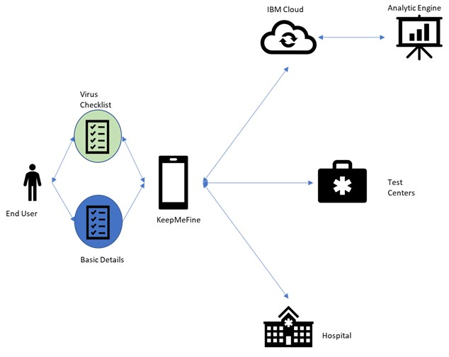
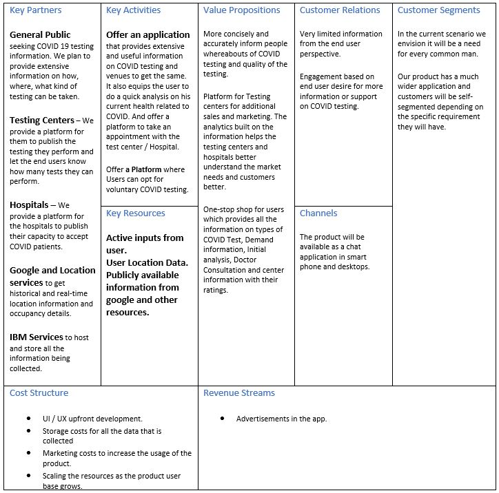
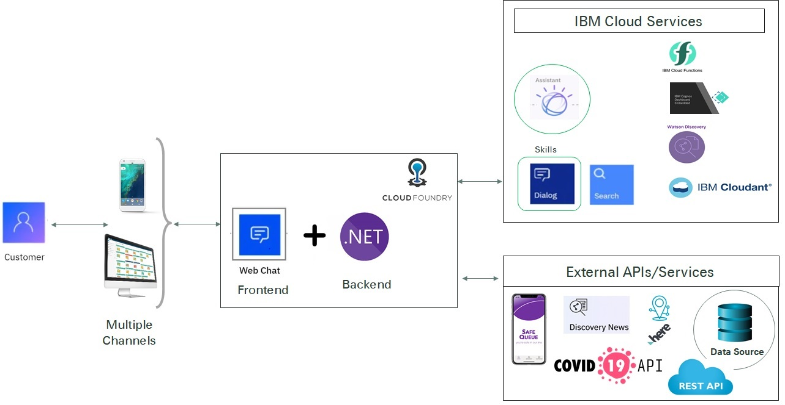

# KeepMeWell-WITHackathon

## Overview

### Problem Statement
COVID-19 has socially and economically brought down several countries across the world. As India enters it's LockDown 5.0 we are still witnessing the rise in the number of cases in India. Currently India is at the 7th most affected nations in the world and with several predictions in place we will soon be on the top 5 spots. Country like India with so much diversity and disparity in literacy, social status, jobs and Age of individual. It has become the need of the hour for the country to focus on the testing strategy. 

Currently there is a sea of information available on COVID-19 related topics all across the internet. But as we enter a phase with heightened numbers we need to have more focus on extensive testing. Today there is a process defined by the Government to go thru a COVID-19 test only if there are any symptoms. Looking at the trend across the world we are going to soon be face to face with the situation where panic will strike many individuals and testing strategy will need to be revised.

The testing strategy will move from "Only when Required" to "Required".  The basic requirement to this effective testing strategy is always to have the right data available. The aim is to develop an open model to enable and equip every individual to make a decision of Voluntary testing.  Our primary goal is addressing this very point. Making the most relevant testing data available, accessible and scalable for not only the users of the project but all the integrated platforms. 

### How can technology help?
In times of crisis, communications systems are often overwhelmed with people trying to find basic information about testing, symptoms, community response, and other resources. When communication lines get clogged, people who need real help can't get through. Chatbots help respond to tens, even hundreds, of thousands of messages a day.

## The Idea
```
Evaluate -> Consult -> Test for COVID19 proactively is the new normal
```

### Description
KeepMeWell chat application will act as an answer for open and voluntary testing in the time of need. By aiding any queries related to testing for COVID-19. The end user is equipped with updated and most important information regarding COVID-19 testing. 

Giving access to the following informtion:
* Available testing centers with their rating and testing kit availability. All the facilities offered by the testing centers. 
* How equipped the hospitals are around the enduser to treat the COVID-19 patients. 
* By capturing the relevant and right information we will aid the mass testing and maximizing the testing feasibility for any location. 
With the Analytics capability that we envision to provide appropriate trends on the testing patterns. Also, helping the government bodies to get right data on the demands for testing and the stock availability in every ward. 

## How it works

### High Level Design


### Business Model


### Solution Architecture


The above diagram shows the technical component architecture of the system
1. User requests COVID information (test centers, hospitals, generic queries, etc..) using mobile or web interface
* The IBM Web Chat component to be used as application frontend, for integration into existing mobile/web applications. 
* The application backend built using ASP.NET
* The KeepMeWell application (Frontend + Backend) to be deployed using IBM Cloud Foundry 

**Implemented as part of the hackthon**
```
----------------------------------------
```
2. The requests are directed to the Watson Assistant, which has skills specific to the use case (COVID test centers, hospitals, generic queries, etc...)
* Test Center and Hospital Information dialog skills added and trained.
```
-----------------------------------------
```
3.	application plans to integrate with various IBM Cloud services
* Watson Discovery – for search on COVID generic queries and news
* IBM Cloundant  - as a datastore
* IBM Cognos – for data visualization and analytics
Etc...
4.	The application plans to integrate with various External APIs/Services
* HERE – for location service
* SafeQueue – enhanced based social distancing
* External Data Sources and APIs – to get COVID related information
Etc...

## Try It
* [KeepMeWell](https://web-chat.global.assistant.watson.cloud.ibm.com/preview.html?region=eu-gb&integrationID=c0008bb7-c974-44aa-8bc1-8fcccba935c6&serviceInstanceID=1b5905fd-895a-4af2-b2ed-dac14f5aa45c) - Chat application using IBM Watson Assistant


## Authors
* Hema Thota
* Nanda Ullas Shanthi
* Parveez Fathima
* Pavithra
* Rajlakshmi Singh
